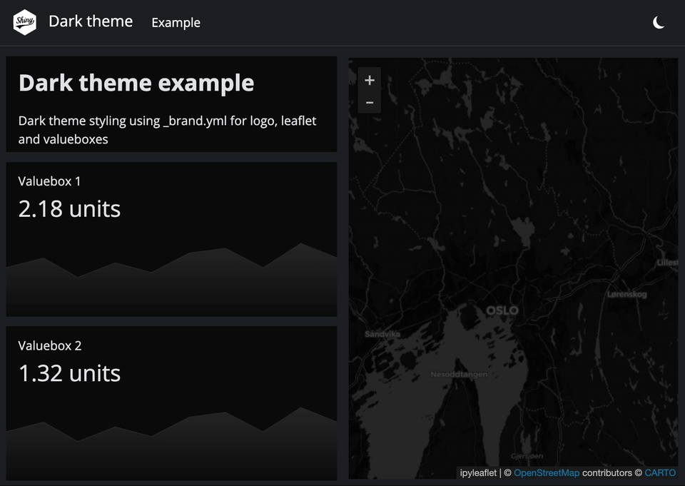
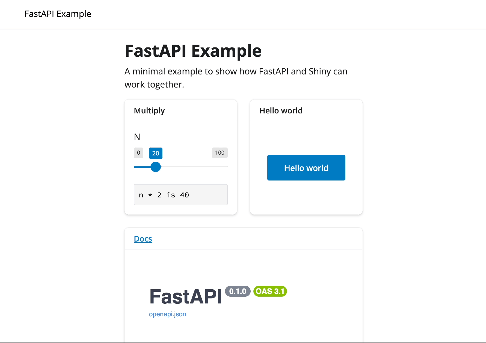
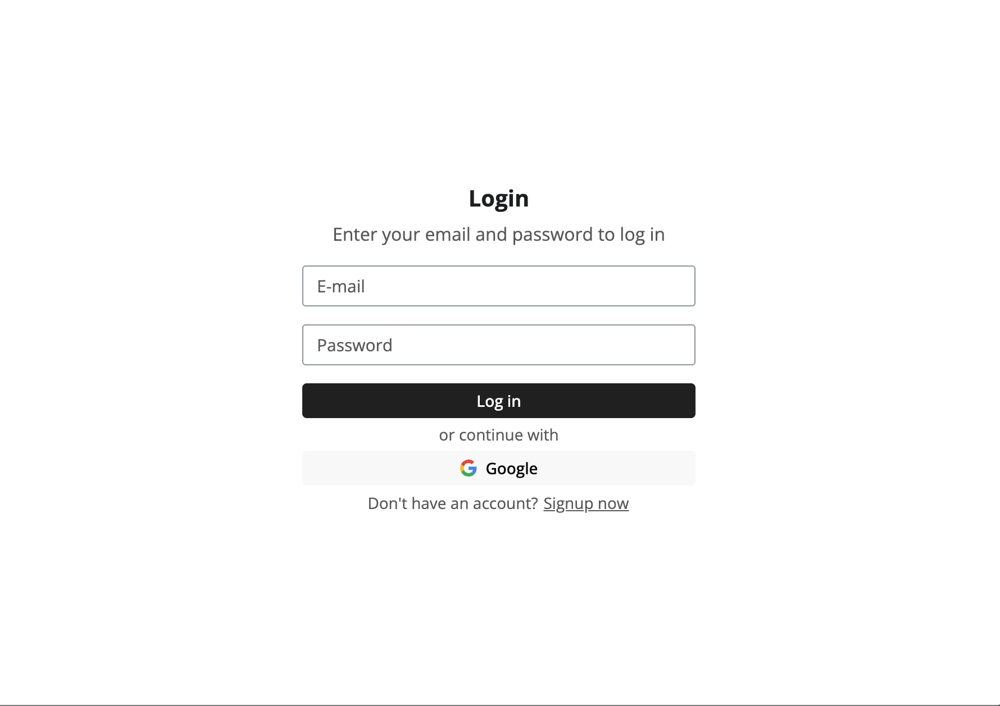
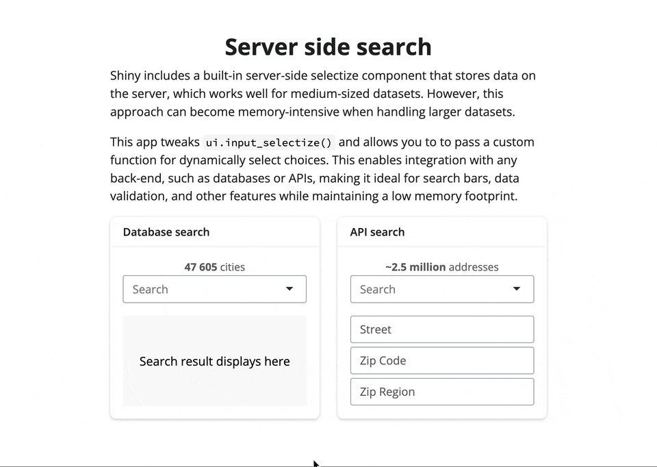
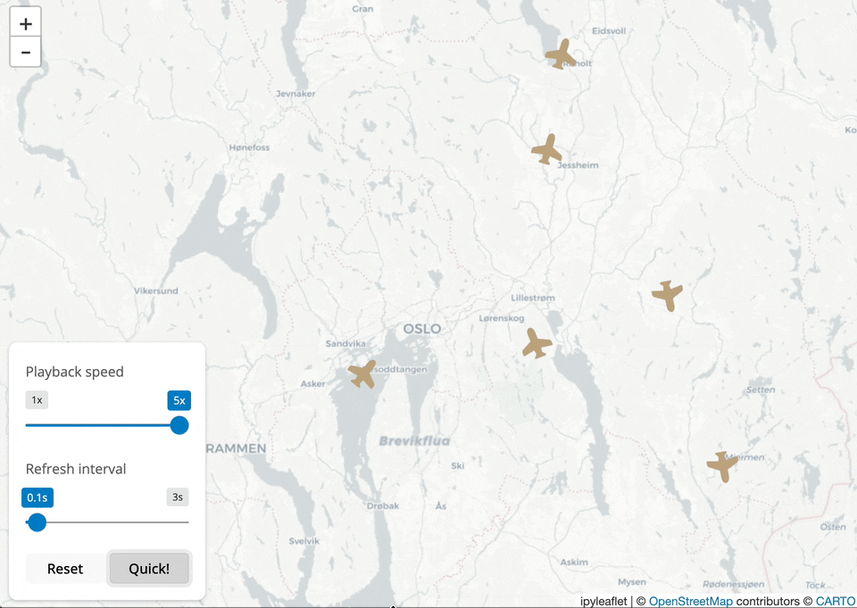
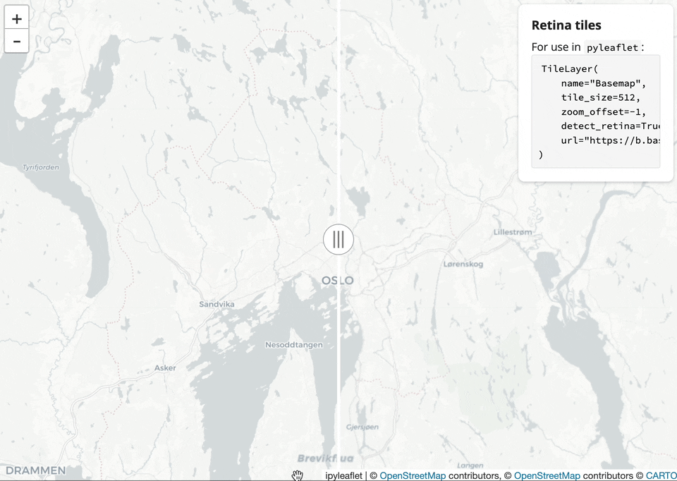
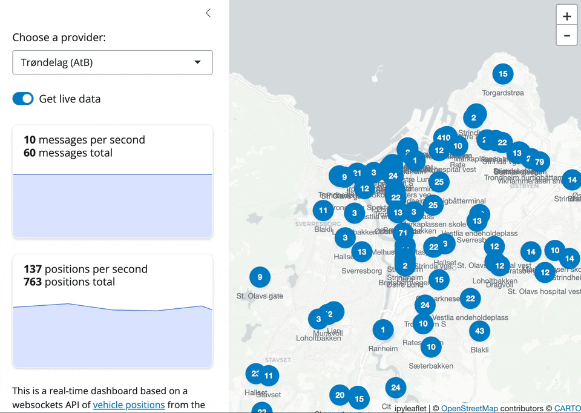

# Apps Overview

This repository contains a collection of personal Shiny templates/apps for demonstrating various functionalities and integrations. It may or may not be useful for others. Visit [thohan88.shinyapps.io/py_shiny_templates/](https://thohan88.shinyapps.io/py_shiny_templates/) to see live examples.


## Running the Apps
Use either codespaces/devcontainers or create your own virtual environment based on `requirements.txt`

To run a gallery app which mounts all sub apps:
```bash
shiny run app
```

To run a standalone app:
```bash
shiny run apps.{app_name}.app
```

## **1. Dark Theme**
A Shiny app showcasing dark theme compatibility with logos, value boxes, and maps. It includes a responsive dark/light mode toggle.
  


## **2. FastAPI Integration**
A minimal example demonstrating the integration of FastAPI and Shiny. The app consists of a FastAPI backend mounted at `/api` and a Shiny frontend.
  


## **3. FastAPIUsers**
A template integrating FastAPI, FastAPIUUsers, and Shiny for Python to provide user authentication and registration functionality.
  


## **4. Input Search**
A server-side search component utilizing DuckDB and selectize.js. Demonstrates fast search across a datasets and APIs without loading all data into memory.
  


## **5. Leaflet Live Positions**
A Shiny app demonstrating real-time position updates on a map using `ipyleaflet`. The app simulates live flight data with adjustable playback speed and refresh intervals.
  


## **6. Leaflet Retina Tiles**
A Shiny app demonstrating side-by-side comparison of retina and non-retina map tiles using ipyleaflet's `SplitMapControl`.
  


## **7. Websockets**
A real-time dashboard built using websockets to stream vehicle positions from the Norwegian transportation company Entur. The app visualizes live data on a map and provides statistics on message and vehicle activity. Note: Contains very limited data during the night (23:00 - 05:00 UTC). 
  

